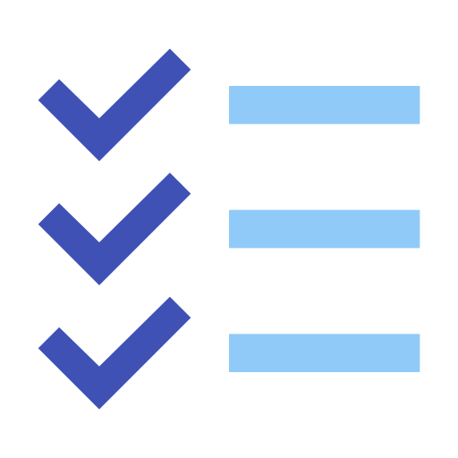
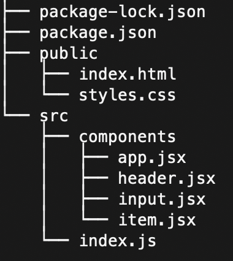

# Todolist Backend 



A todolist webapp built with react and NodeJS.

* **Add** items to your list.
* **Mark** items on your list.
* **Edit** items on your list.
* **Delete** items from your list.


## Technologies used in this project:


<br />

## Getting started:

Below we have the **directory tree** of the project.

<p align="center">
  
</p>

Make sure you move to the **project directory** and run the following command in the terminal:

```shell
npm install
```

Now you can run the following command to start the server:

```shell
npm start
```

After starting the server you can access the app on the **http://localhost:3000** address.

---

## Note

Feel free to download the project and build upon it. Happy coding!