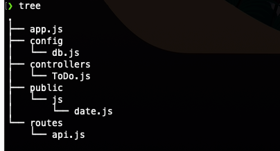

# Todolist Backend 


A simple RESTful API built in Node.js. It provides the user with basic
CRUD operations.

* **GET** Retrieve information from the database.
* **POST** Insert data into a database.
* **PUT** Update data in the database.
* **DELETE** Delete data from the database.

## Technologies used in this project:


<br />

## Getting started:

Below we have the **directory tree** of the project.

<p align="center">
  
</p>

Make sure you have **mongodb** installed on your system and is up and running. Move to the 
project directory **/BackendTodolist** using your terminal. Now make sure you first initialize your npm.

```shell
npm init
```

Now make sure you have **express** and **mongoose** packages installed.

```shell
npm i express mongoose
```

Now move to the src folder **/BackendTodolist/src** and run the project using **nodemon** if you have it installed.

```shell
nodemon app.js
```

<br />

## Note

Feel free to download the project and build upon it. Happy coding!